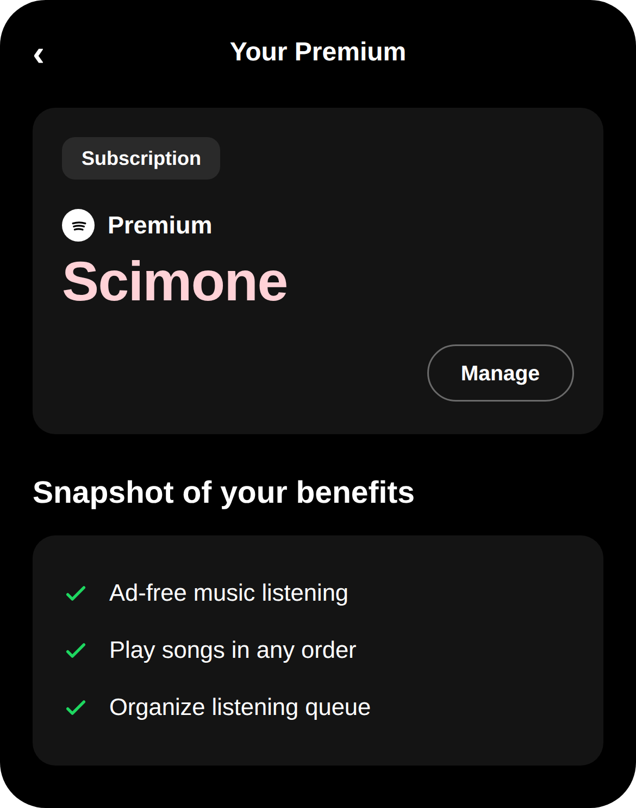

# Scimonetify

**Maintainer:** [Danilo Scimone](https://github.com/daniloscimone) · **Website:** [scimonetify.site](https://scimonetify.site)  
**Forked from:** EeveeSpotifyReincarnated by [jaydenjcpy](https://github.com/jaydenjcpy), [faroukbmiled](https://github.com/faroukbmiled) & [Mod4](https://github.com/M0d-4) (full credits below)  
**Last Update:** `8/02/26` · **Spotify Version:** `9.1.68`

Scimonetify is an iOS tweak that unlocks Spotify's Premium features for free — no ads, on-demand playback, unlimited skips, high-quality audio — plus extras Spotify doesn't offer at all, like custom time-synced lyrics from four different providers. Instead of patching Spotify's binary logic directly, it intercepts Spotify's own network traffic and rewrites the responses in real time, which is what keeps it stable across the versions it supports.

> [!NOTE]
> The original EeveeSpotify repository was disabled following a [DMCA takedown](https://github.com/github/dmca/blob/master/2025/08/2025-08-14-spotify.md). This repository does not and will not contain IPA packages — source code only, plus a standalone tweak `.deb` where that's legally clean to distribute.

## Features

- **No ads** — audio and video ads stripped from playback and browse screens.
- **Full Premium access** — on-demand playback, unlimited skips, high / very-high audio quality, offline downloads.
- **Custom lyrics** — time-synced lyrics from Musixmatch, LRCLIB, PetitLyrics, or Genius. See [Lyrics](#lyrics).
- **Track rows on artist pages** — full tracklists and liked songs, like on Premium.
- Works both **jailbroken** (as a `.deb` tweak) and **without jailbreak** (as a sideloaded IPA).

## Installation

### Jailbroken? Use the `.deb`

Grab the latest package from the [Releases page](https://github.com/daniloscimone/Scimonetify/releases) and install it with **Sileo** or **Zebra**. It hooks directly into the official Spotify app you already have from the App Store — no IPA to source yourself, and it always matches whatever Spotify version is currently installed.

### Not jailbroken? Build and sideload an IPA

1. Build your own IPA from source — see [How to build a Scimonetify IPA using GitHub Actions](#how-to-build-a-scimonetify-ipa-using-github-actions) below. You'll need your own decrypted Spotify IPA; this project cannot provide one.
2. Install it with a sideloading tool:

<strong>Using Sideloadly</strong>

1. Download and install [Sideloadly](https://sideloadly.io/#download) on your computer.
2. Connect your iPhone with a cable and unlock it; tap "Trust" if prompted.
3. Open Sideloadly and drag your `.ipa` file into the app window.
4. Enter your Apple ID — only used to sign the app (a free account expires after 7 days; a paid Developer account lasts a year).
5. Click **Start** and wait for it to finish.
6. On your iPhone, go to **Settings → General → VPN & Device Management** and trust the profile.

<strong>Using AltStore</strong>

1. Install AltServer on your computer from [altstore.io](https://altstore.io/#Downloads) and connect your iPhone.
2. From AltServer, choose **Install AltStore**, select your device, and sign in with your Apple ID.
3. Transfer the `.ipa` to your phone (AirDrop, Files, or iCloud Drive).
4. Open AltStore on your iPhone, go to **My Apps**, tap **+**, and select the file.
5. AltStore re-signs it automatically every 7 days, as long as your computer stays reachable on the network.
6. As above, trust the profile under **Settings → General → VPN & Device Management**.

Prefer a video walkthrough? See the [tutorial on scimonetify.site](https://scimonetify.site/#tutorial).

> [!IMPORTANT]
> Whatever IPA you inject the tweak into must be a **supported Spotify version** (currently `9.1.68`, or `9.0.48` / `8.9.8`). Scimonetify detects the Spotify version at runtime and only activates the hooks that match it — an unsupported or much older Spotify binary will make most features silently do nothing, without crashing.

To open Spotify links directly inside a sideloaded app, install [OpenSpotifySafariExtension](https://github.com/BillyCurtis/OpenSpotifySafariExtension) and enable it under **Settings → Safari → Extensions**.

## How to build a Scimonetify IPA using GitHub Actions

> [!NOTE]
> First time doing this? Complete these steps before starting:
>
> 1. Fork this repository using the fork button at the top right.
> 2. On your fork, go to **Settings → Actions**, and enable **Read and write permissions**.

  
How to build the Scimonetify IPA

  <ol>
    <li>Click <strong>Sync fork</strong>, and if your branch is out of date, click <strong>Update branch</strong>.</li>
    <li>Go to the <strong>Actions</strong> tab on your fork and select <strong>Create IPA Packages</strong> (on mobile, tap <strong>All Workflows</strong> first).</li>
    <li>Click <strong>Run workflow</strong> on the right.</li>
    <li>Prepare a decrypted <code>.ipa</code> file <em>(we cannot provide this, for legal reasons)</em>, upload it to a file host (filebin.net, filemail.com, or Dropbox work well), and paste the direct download URL into the field provided.</li>
    <li><strong>Note:</strong> the link must point directly to the file, not to a webpage — otherwise the build will fail.</li>
    <li>Go to the Releases page of the Scimonetify repository (<strong>not</strong> your fork), and copy the link of the <code>.deb</code> matching your phone's architecture.</li>
    <li>Double-check all the inputs, then click <strong>Run workflow</strong> to start the build.</li>
    <li>Once it finishes, download your IPA from your fork's own Releases section (if you can't find it, add <code>/releases</code> to your fork's URL).</li>
  </ol>

## Lyrics

Scimonetify replaces Spotify's monthly-limited lyrics with your choice of four providers. **Spotify 9.1.56 and above** gets full support for all of them:

- **Genius** — the best quality and widest song coverage, and the fastest to update. Never time-synced.
- **LRCLIB** — the most open service, with time-synced lyrics, but missing many songs.
- **Musixmatch** — the same service Spotify itself uses, time-synced for most songs. Requires a personal user token: install Musixmatch from the App Store, sign up, go to **Settings → Get help → Copy debug info**, and paste it into the Scimonetify alert (or extract it via MITM).
- **PetitLyrics** — strong for time-synced Japanese lyrics, plus some international coverage.

If a song can't be found, you'll see "Couldn't load the lyrics for this song." Lyrics from Genius may occasionally be mismatched due to how song search works there — this is a known limitation, please don't open issues about it.

## How It Works

Scimonetify intercepts the requests Spotify uses to load your user/product state, deserializes them, and rewrites the relevant fields in real time — rather than patching app logic directly. This is what makes it stable across every Spotify version it supports.

It also flips `trackRowsEnabled` to `true`, so you see full track rows and liked songs on artist pages, exactly like on Premium.

## Restrictions

These features are server-side and will **never** work, no matter what — please don't open issues about them:

- Very High audio quality
- Native playlist downloading (podcast episode downloads do work)
- Spotify Jam hosting or joining remotely (joining in person still works)
- AI DJ / AI Playlist
- Spotify Connect (the device acts purely as a remote control and streams to another device — a server-side limitation Scimonetify has no way around, so it behaves as Free tier here)

## [Common Issues](https://github.com/daniloscimone/Scimonetify/blob/Master/common_issues.md)

Please check the link above before opening a new issue.

## The History

In January 2024, Spotilife — until then the only working tweak for free Spotify Premium — stopped working on new Spotify versions. [whoeevee](https://github.com/whoeevee) decompiled it, reverse-engineered Spotify's own request handling, and built EeveeSpotify from scratch.

In December 2025, whoeevee announced he'd be stepping back from maintaining EeveeSpotify, unable to keep pace with Spotify's constantly shifting internals. [Meep1](https://github.com/Meeep1) (aka Skye) soon forked the project to keep supporting newer Spotify versions, under the name EeveeSpotifyRevivedPublic.

In March 2026, EeveeSpotifyRevivedPublic's latest release (v9.1.28) started causing constant logout issues, and updates stalled. Frustrated by the bug, the SideloadLabs team forked the project, fixed the logout issue, and released it as **EeveeSpotifyReincarnated** — carrying EeveeSpotify's legacy forward.

In August 2026, [Danilo Scimone](https://github.com/daniloscimone) forked EeveeSpotifyReincarnated to create **Scimonetify** — his personal continuation of the project, with its own branding, a purple theme, and more to come.

## Credits

Scimonetify is maintained by [Danilo Scimone](https://www.daniloscimone.me), continuing the project as a personal fork of EeveeSpotifyReincarnated.

Thanks to everyone in the community, and to every developer whose work this builds on:

- [whoeevee](https://github.com/whoeevee) — created EeveeSpotify
- [Skye / Meep1](https://github.com/Meeep1) — EeveeSpotifyRevivedPublic
- [Ryuk / faroukbmiled](https://github.com/faroukbmiled)
- [Mod4](https://github.com/M0d-4)
- [estrogencat](https://github.com/estrogencat)

## Disclaimer

This project is an **independent modification ("tweak")** for the Spotify app. It is **not affiliated with, endorsed by, or in any way officially connected to Spotify** or any of its subsidiaries or affiliates.

It exists purely for **personal and educational purposes**. Use it at your own risk — **we take no responsibility** for any issues, damages, or consequences arising from its use or misuse.
